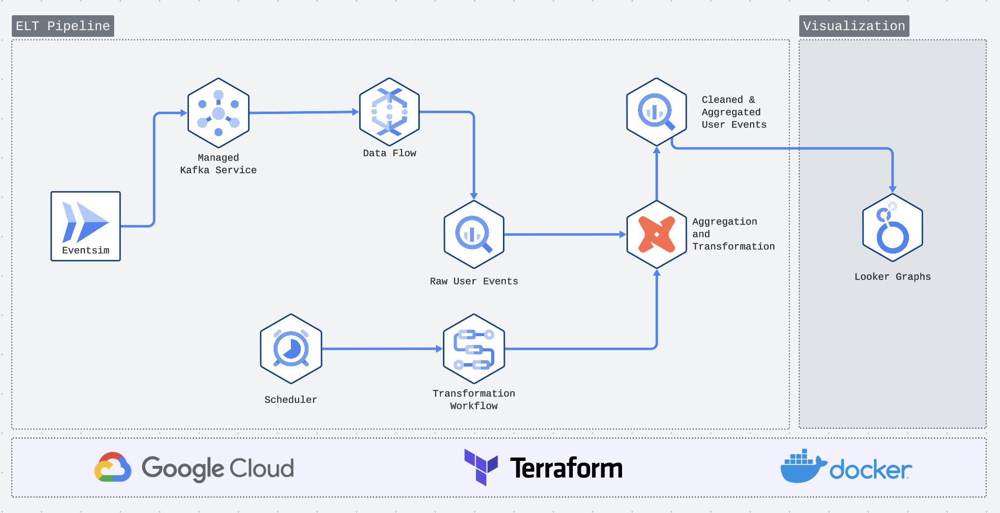
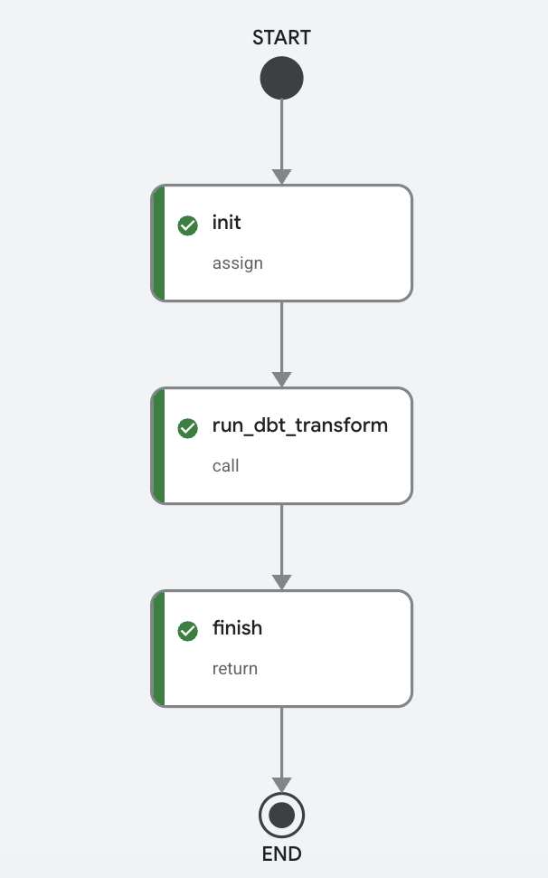

# Music Streaming Service - User Events Data Pipeline

## Overview

This project implements a complete ELT data pipeline using [EventSim](https://github.com/Interana/eventsim), EvenSim is a user events simulator for music service like spotify. EventSim is run as cloud run job and generates realistic user event data and ingests it into Google Managed Kafka. Dataflow streams kafka events to BigQuery, applies DBT transformations, and visualizes insights via Looker Studio dashboards.
Image used for generate user events are build from [forked version of eventsim](https://github.com/mailmelakhan/eventsim), docker hub image [mailmelakhan/eventsim](https://hub.docker.com/repository/docker/mailmelakhan/eventsim/general). 


## Project Architecture



## Tech Stack

| Component | Technology                    |
|-----------|-------------------------------|
| Event Simulation | EventSim (Docker)             |
| Streaming Messages | Google Managed Kafka          |
| Data Processing | Google Dataflow and Cloud Run |
| Data Warehouse | Google BigQuery               |
| Transformations | DBT (Data Build Tool)         |
| Infrastructure | Terraform                     |
| Orchestration | Google Workflows              |
| Visualization | Looker Studio                 |

## Prerequisites

Before starting, ensure you have:

1. **Git** - Version control
2. **Terraform** (>= 1.0) - Infrastructure as code
3. **Docker Desktop** - Container runtime
4. **Google Cloud Platform Account** - Active GCP project with billing enabled
5. **gcloud CLI** - Google Cloud command-line tool

## Step-by-Step Setup

### 1. Clone the Repository

```bash
git clone https://github.com/mailmelakhan/simulated-event-stream.git
cd simulated-event-stream
```

### 2. Authenticate with GCP

```bash
# Set your project ID
export PROJECT_ID="your-project-id"

# Configure gcloud
gcloud config set project $PROJECT_ID

# Login to GCP
gcloud auth login

# Set application default credentials (required for local DBT runs)
gcloud auth application-default login
```

### 3. Enable Required GCP APIs

Enable the following APIs for your GCP project:

```bash
gcloud services enable \
  managedkafka.googleapis.com \
  dataflow.googleapis.com \
  bigquery.googleapis.com \
  bigquerystorage.googleapis.com \
  run.googleapis.com \
  storage.googleapis.com \
  workflowexecutions.googleapis.com \
  workflows.googleapis.com \
  iam.googleapis.com \
  cloudscheduler.googleapis.com
```

### 4. Build DBT Transformation Image (Optional)

The pre-built DBT image is available on Docker Hub. If you want to rebuild, change directory to `transformations` folder, 
and then run following command with appropriate tag name:

```bash
docker buildx build --platform linux/amd64,linux/arm64 \
  -t mailmelakhan/dbt_transform_user_events \
  -t mailmelakhan/dbt_transform_user_events:0.0.4 \
  . --push
```

### 5. Initialize and Apply Terraform

Navigate to the terraform directory:

```bash
cd terraform
```

Initialize Terraform:

```bash
terraform init
```

Plan the infrastructure:

```bash
terraform plan -var="project_id=$PROJECT_ID"
```

Apply the configuration:

```bash
terraform apply -var="project_id=$PROJECT_ID"
```

This creates:
- Google Managed Kafka cluster
- Kafka topic
- BigQuery dataset and tables
- Cloud Storage bucket
- Dataflow flex template job
- Cloud Run jobs (event simulator, DBT transformations)
- Scheduler and Workflow
- Required service accounts and IAM roles

### 6. Execute the Event Simulator

Run the Cloud Run job to generate user events and send them to Kafka:

```bash
gcloud run jobs execute user-event-simulator \
  --region us-central1 \
  --project $PROJECT_ID \
  --wait
```

This job:
- Generates events for 1000 users
- Simulates 366 days of user activity
- Applies 4% annual growth rate
- Produces over 1 million events
- You can refer [EventSim](https://github.com/mailmelakhan/eventsim#usage) and update these parameters to play around


### 7. Execute DBT Transformations Workflow

After events are ingested to BigQuery, run the DBT transformation workflow:

```bash
gcloud workflows run transformation-workflow \
  --project $PROJECT_ID \
  --location us-central1
```
Check workflow status at https://console.cloud.google.com/workflows/workflow/us-central1/transformation-workflow/executions


### 8. Run DBT Locally (Optional)

For local development or testing:

```bash
# Set up profiles.yml for local DBT
# Ensure you have run: gcloud auth application-default login

cd transformations
dbt deps
dbt run --target dev
```

### 9. View the Dashboard

Access the Looker Studio dashboard:

**[User Event Data Analytics Dashboard](https://datastudio.google.com/s/iPrASsnYy1E)**

Alternatively, view the PDF version:

- [User Events Analytics Dashboard PDF](static_resources/User_Event_Data_Analytics_Dashboard.pdf)

## Pipeline Components

### Cloud Run Jobs

| Job Name | Description |
|---------|-------------|
| user-event-simulator | Generates and streams user events to Kafka |
| dbt-transform-user-events | Runs DBT transformations on BigQuery data |

### BigQuery Tables

| Table | Description |
|-------|-------------|
| user-events-table | Raw user event data (partitioned by day) |
| user-events-table-dlq | Dead letter queue for failed records |

### Kafka Configuration

| Property | Value |
|----------|-------|
| Bootstrap Server | `bootstrap.{cluster}.{location}.managedkafka.{project}.cloud.goog:9092` |
| Topic | `user-events-topic` |
| Partitions | 2 |
| Replication Factor | 3 |

### Google Workflows

| Workflow Name           | Description |
|-------------------------|-------------|
| transformation-workflow | Executes the DBT transformation Cloud Run job |

The workflow is configured to run the `dbt_transform` Cloud Run job, which performs DBT transformations on the BigQuery data.

### Cloud Scheduler

A Cloud Scheduler job runs the workflow every morning at 8 AM:

| Schedule | Timezone | Target |
|----------|----------|--------|
| `0 8 * * *` | UTC | workflow-scheduler |


## Cleanup

To destroy all GCP resources:

```bash
cd terraform
terraform destroy -var="project_id=$PROJECT_ID
```

**Warning:** This will delete all data including BigQuery tables, Kafka topics, and Cloud Storage data. Ensure you have backed up any important data before running destroy.

## Troubleshooting

### Kafka Connection Errors

If you see `FailedToSendMessageException`:
- Verify the Kafka cluster is created and running
- Check VPC access configuration for Cloud Run
- Ensure the service account has `roles/managedkafka.client`

### Dataflow Job Failures

Check Dataflow job logs:
```bash
gcloud dataflow jobs list --region us-central1
gcloud dataflow jobs show JOB_ID --region us-central1
```

### DBT Transformation Errors

For local DBT runs:
```bash
cd transformations
dbt debug --target dev
dbt run --target dev --log-level debug
```

## Additional Resources

- [EventSim Documentation](https://github.com/Interana/eventsim)
- [DBT Documentation](https://docs.getdbt.com/)
- [Google Managed Kafka](https://cloud.google.com/managed-kafka/docs)
- [Google Dataflow](https://cloud.google.com/dataflow/docs)
